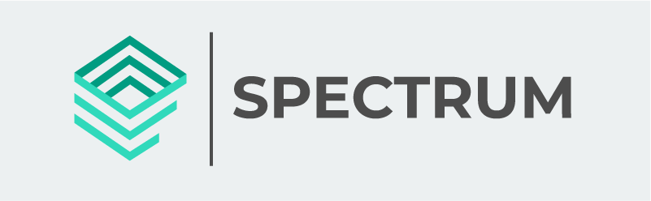

<h1 align="center">
    
</h1>

<h2 align="center"> 
	Spectrum Team
</h2>

## 🌌 Sobre a organização

Somos uma equipe de desenvolvedores com a ideia de alimentar a comunidade com o máximo de projetos reais e sem fins lucrativos afim de engajar o desenvolvedor colaborativo na área, participando de projetos com código compartilhado! É uma ótima oportunidade participar de projetos open-source, além de afinar seu conhecimento você também cria um portfólio incrível em projetos reais, junto com um time.

Essa é a sua hora de deixar de ser um mero espectro 👻 vagando pela comunidade e colocar a mão na massa! 💪

---

## ⚙️ Projetos em desenvolvimento

- [ ] Digital Influencer - Um aplicativo para gerenciamento completo de Jobs para um digital influencer.

## 🛠 Tecnologias

As tecnologias de preferencia para nossos projetos são:

-   **[ReactJS](https://github.com/facebook/react)**
-   **[React Native](https://github.com/facebook/react-native)**
-   **[Node.js](https://github.com/nodejs/node)**

> Porém sinta-se a vontade em utilizar a tecnologia que mais lhe agrada. 👨‍🚀

---

Feito com ❤️ por Lucas Melo